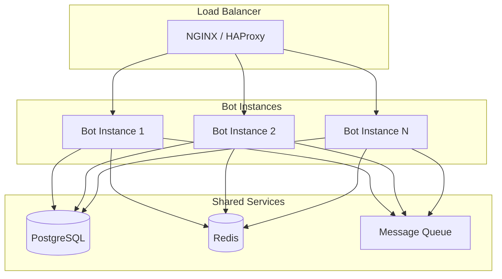

# Architecture Overview

## System Architecture - Bot-to-Bot Telegram Platform

### Table of Contents

1. [High-Level Architecture](#high-level-architecture)
2. [Component Architecture](#component-architecture)
3. [Data Flow](#data-flow)
4. [Technology Stack](#technology-stack)
5. [Scalability Patterns](#scalability-patterns)
6. [Security Architecture](#security-architecture)

---

## High-Level Architecture

### System Overview

```
┌─────────────────────────────────────────────────────────────────────────────┐
│                           TELEGRAM PLATFORM                                  │
│  ┌───────────────┐  ┌───────────────┐  ┌───────────────┐                   │
│  │  User Bot 1   │  │  User Bot 2   │  │  User Bot N   │                   │
│  │  (Managed)    │  │  (Managed)    │  │  (Managed)    │                   │
│  └───────┬───────┘  └───────┬───────┘  └───────┬───────┘                   │
│          │                  │                  │                            │
│          └──────────────────┼──────────────────┘                            │
│                             ▼                                                 │
│                  ┌────────────────────────┐                                 │
│                  │   MANAGER BOT (CORE)    │                                 │
│                  │  ┌──────────────────┐   │                                 │
│                  │  │ Bot Factory      │   │                                 │
│                  │  │ Token Manager    │   │                                 │
│                  │  │ User Manager     │   │                                 │
│                  │  │ API Gateway      │   │                                 │
│                  │  └──────────────────┘   │                                 │
│                  └───────────┬─────────────┘                                 │
│                              │                                                │
│        ┌─────────────────────┼─────────────────────┐                        │
│        ▼                     ▼                     ▼                         │
│  ┌─────────────┐      ┌─────────────┐      ┌─────────────┐                  │
│  │ AI Agents   │      │  Database   │      │   Redis     │                  │
│  │   (MCP)     │      │ PostgreSQL  │      │ Cache/Queue │                  │
│  └─────────────┘      └─────────────┘      └─────────────┘                │
└─────────────────────────────────────────────────────────────────────────────┘
```

### Architecture Layers

#### Layer 1: Telegram Platform
- **User Bots** - Managed bots created by users
- **Manager Bot** - Central bot that manages all operations
- **Telegram API** - Communication with Telegram servers

#### Layer 2: Core Services
- **Bot Factory** - Creates and configures new managed bots
- **Token Manager** - Stores and retrieves bot tokens
- **User Manager** - Manages user permissions
- **API Gateway** - Routes requests to services

#### Layer 3: Agent Orchestration
- **Agent Registry** - Maintains available AI agents
- **Task Queue** - Manages pending tasks
- **State Store** - Shares context between agents
- **Event Bus** - Distributes events

#### Layer 4: Infrastructure
- **Message Broker** - Async message processing
- **Rate Limiter** - Enforces API limits
- **Health Checker** - Monitors health
- **Metrics Collector** - Gathers metrics

---

## Component Architecture

### Manager Bot Components

#### BotFactory

Responsibilities:
- Create new managed bots via API
- Configure bot settings (name, description, avatar)
- Generate bot usernames
- Initialize bot with default handlers

```typescript
interface BotFactory {
  createBot(config: BotConfig): Promise<ManagedBot>;
  configureBot(botId: string, settings: BotSettings): Promise<void>;
  deleteBot(botId: string): Promise<void>;
  listBots(): Promise<ManagedBot[]>;
}
```

#### TokenManager

Responsibilities:
- Securely store bot tokens
- Retrieve tokens for bot operations
- Handle token rotation
- Manage token lifecycle

```typescript
interface TokenManager {
  storeToken(botId: string, token: string): Promise<void>;
  getToken(botId: string): Promise<string>;
  revokeToken(botId: string): Promise<void>;
  rotateToken(botId: string): Promise<string>;
}
```

#### UserManager

Responsibilities:
- Manage user registrations
- Handle permissions and roles
- Track user bot allocations
- Handle authentication

```typescript
interface UserManager {
  registerUser(userId: string, data: UserData): Promise<User>;
  getUser(userId: string): Promise<User>;
  updateUser(userId: string, data: Partial<UserData>): Promise<User>;
  assignBot(userId: string, botId: string): Promise<void>;
}
```

#### APIGateway

Responsibilities:
- Route incoming requests
- Validate requests
- Rate limiting
- Request logging

```typescript
interface APIGateway {
  route(request: Request): Promise<Response>;
  validate(request: Request): boolean;
  rateLimit(identifier: string): Promise<boolean>;
}
```

---

## Data Flow

### User Creates Managed Bot

```
1. User → Telegram: Sends /create command
2. Telegram → Manager Bot: Forwards message (managed_bot update)
3. Manager Bot → BotFactory: createBot(request)
4. BotFactory → Telegram API: Creates bot via getManagedBotToken
5. Telegram API → BotFactory: Returns bot token
6. BotFactory → TokenManager: storeToken(botId, token)
7. BotFactory → Manager Bot: Returns bot info
8. Manager Bot → Telegram: Sends confirmation message
9. Manager Bot → Database: Records bot creation
```

### Bot-to-Bot Communication

```
1. Bot A → Telegram: Sends message mentioning @BotB
2. Telegram → Bot B: Delivers message (if B2B enabled)
3. Bot B → AI Agent: Processes message
4. AI Agent → Bot B: Generates response
5. Bot B → Telegram: Sends reply
6. Telegram → Bot A: Delivers response
```

### Multi-Agent Task Processing

```
1. User → Manager Bot: Submits complex task
2. Manager Bot → AgentOrchestrator: distributeTask(task)
3. AgentOrchestrator → Research Agent: search(query)
4. Research Agent → AgentOrchestrator: returnResults(data)
5. AgentOrchestrator → Analyzer Agent: analyze(data)
6. Analyzer Agent → AgentOrchestrator: returnInsights(insights)
7. AgentOrchestrator → Reporter Agent: format(insights)
8. Reporter Agent → Manager Bot: finalOutput
9. Manager Bot → User: Send result
```

---

## Technology Stack

### Primary Technologies

| Category | Technology | Purpose |
|----------|------------|---------|
| Bot Framework | aiogram 3.x | Python bot development |
| Bot Framework | Telegraf 4.x | Node.js bot development |
| Bot Framework | grammY | TypeScript bot development |
| AI Integration | MCP | Model Context Protocol |
| Frontend | React 18 | Dashboard UI |
| Backend | Node.js/Express | API server |
| Database | PostgreSQL 15 | Primary database |
| Cache/Queue | Redis 7 | Caching and queues |
| Container | Docker | Containerization |

### SDKs and Libraries

#### Python
- `aiogram` - Async Telegram bot framework
- `python-telegram-bot` - Synchronous alternative
- `aiogram-mcp` - MCP integration
- `asyncpg` - Async PostgreSQL driver
- `redis` - Redis client

#### Node.js
- `telegraf` - Telegram bot framework
- `grammY` - TypeScript framework
- `@modelcontextprotocol/sdk` - MCP client
- `pg` - PostgreSQL client
- `ioredis` - Redis client

#### Frontend
- `react` - UI framework
- `typescript` - Type safety
- `@tma.js/sdk` - Telegram Mini Apps SDK
- `zustand` - State management
- `react-query` - Data fetching

---

## Scalability Patterns

### Horizontal Scaling



### Rate Limiting Pattern

```typescript
class TokenBucketLimiter {
  private tokens: number;
  private lastRefill: number;
  private readonly capacity: number;
  private readonly refillRate: number; // tokens per second

  constructor(capacity: number = 30, refillRate: number = 30) {
    this.capacity = capacity;
    this.refillRate = refillRate;
    this.tokens = capacity;
    this.lastRefill = Date.now();
  }

  async acquire(): Promise<boolean> {
    this.refill();
    
    if (this.tokens >= 1) {
      this.tokens -= 1;
      return true;
    }
    
    return false;
  }

  private refill(): void {
    const now = Date.now();
    const elapsed = (now - this.lastRefill) / 1000;
    const newTokens = elapsed * this.refillRate;
    this.tokens = Math.min(this.capacity, this.tokens + newTokens);
    this.lastRefill = now;
  }
}
```

### Queue-Based Processing

```typescript
interface MessageQueue {
  enqueue(message: Message): Promise<void>;
  dequeue(): Promise<Message | null>;
  acknowledge(messageId: string): Promise<void>;
  deadLetter(messageId: string, error: Error): Promise<void>;
}
```

---

## Security Architecture

### Authentication Flow

```
User → Telegram → InitData → Backend → Validate HMAC → Session
```

### Security Measures

1. **Token Storage** - Encrypt bot tokens at rest
2. **Request Validation** - Validate all incoming requests
3. **Rate Limiting** - Prevent abuse
4. **Audit Logging** - Track all operations
5. **Input Sanitization** - Prevent injection attacks

### Token Encryption

```typescript
import { createCipheriv, createDecipheriv } from 'crypto';

const algorithm = 'aes-256-gcm';
const key = Buffer.from(process.env.ENCRYPTION_KEY!, 'hex');

function encryptToken(token: string): string {
  const iv = crypto.randomBytes(16);
  const cipher = createCipheriv(algorithm, key, iv);
  
  let encrypted = cipher.update(token, 'utf8', 'hex');
  encrypted += cipher.final('hex');
  
  const authTag = cipher.getAuthTag();
  
  return iv.toString('hex') + ':' + authTag.toString('hex') + ':' + encrypted;
}

function decryptToken(encrypted: string): string {
  const [ivHex, authTagHex, encryptedData] = encrypted.split(':');
  
  const iv = Buffer.from(ivHex, 'hex');
  const authTag = Buffer.from(authTagHex, 'hex');
  
  const decipher = createDecipheriv(algorithm, key, iv);
  decipher.setAuthTag(authTag);
  
  let decrypted = decipher.update(encryptedData, 'hex', 'utf8');
  decrypted += decipher.final('utf8');
  
  return decrypted;
}
```

---

## Monitoring and Observability

### Key Metrics

| Metric | Description | Alert Threshold |
|--------|-------------|-----------------|
| Messages per second | Processing rate | > 1000 |
| 429 error rate | Rate limit hits | > 5% |
| P99 latency | Response time | > 2s |
| Error rate | General errors | > 1% |
| Queue depth | Pending messages | > 10000 |

### Logging Structure

```json
{
  "timestamp": "2026-04-18T12:00:00Z",
  "level": "info",
  "service": "manager-bot",
  "action": "create_bot",
  "userId": "123456",
  "botId": "789012",
  "duration": 150,
  "success": true
}
```

---

## Deployment Architecture

### Production Setup

```yaml
version: '3.8'

services:
  manager-bot:
    image: bot-to-bot/manager-bot:latest
    replicas: 3
    environment:
      - DATABASE_URL=postgresql://postgres:password@db:5432/bots
      - REDIS_URL=redis://redis:6379
    depends_on:
      - db
      - redis

  api-gateway:
    image: bot-to-bot/api-gateway:latest
    replicas: 2
    ports:
      - "8080:8080"

  db:
    image: postgres:15
    volumes:
      - pgdata:/var/lib/postgresql/data

  redis:
    image: redis:7
    volumes:
      - redisdata:/data
```

---

**Last Updated:** April 18, 2026
**Version:** 1.0.0