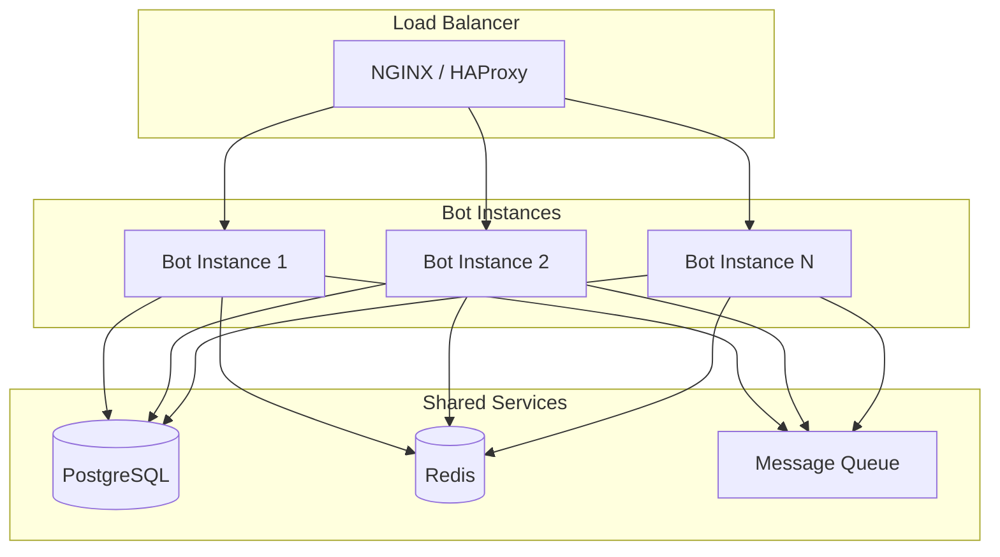

# Архитектура системы - Платформа Bot-to-Bot Telegram

## Содержание

1. [Общая архитектура](#общая-архитектура)
2. [Компонентная архитектура](#компонентная-архитектура)
3. [Поток данных](#поток-данных)
4. [Технологический стек](#технологический-стек)
5. [Паттерны масштабирования](#паттерны-масштабирования)
6. [Безопасность](#безопасность)

---

## Общая архитектура

### Обзор системы

```
┌─────────────────────────────────────────────────────────────────────────────┐
│                           ПЛАТФОРМА TELEGRAM                                │
│  ┌───────────────┐  ┌───────────────┐  ┌───────────────┐                   │
│  │  Бот 1        │  │  Бот 2        │  │  Бот N        │                   │
│  │  (managed)    │  │  (managed)    │  │  (managed)    │                   │
│  └───────┬───────┘  └───────┬───────┘  └───────┬───────┘                   │
│          │                  │                  │                            │
│          └──────────────────┼──────────────────┘                            │
│                             ▼                                                 │
│                  ┌────────────────────────┐                                 │
│                  │   MANAGER BOT (CORE)   │                                 │
│                  │  ┌──────────────────┐   │                                 │
│                  │  │ Bot Factory       │   │                                 │
│                  │  │ Token Manager     │   │                                 │
│                  │  │ User Manager      │   │                                 │
│                  │  │ API Gateway       │   │                                 │
│                  │  └──────────────────┘   │                                 │
│                  └───────────┬─────────────┘                                 │
│                              │                                                │
│        ┌─────────────────────┼─────────────────────┐                        │
│        ▼                     ▼                     ▼                         │
│  ┌─────────────┐      ┌─────────────┐      ┌─────────────┐                  │
│  │ AI Agents   │      │  Database   │      │   Redis     │                  │
│  │   (MCP)     │      │ PostgreSQL  │      │ Cache/Queue │                  │
│  └─────────────┘      └─────────────┘      └─────────────┘                │
└─────────────────────────────────────────────────────────────────────────────┘
```

### Уровни архитектуры

#### Уровень 1: Платформа Telegram
- **Пользовательские боты** - Управляемые боты, созданные пользователями
- **Manager Bot** - Центральный бот, управляющий всеми операциями
- **Telegram API** - Коммуникация с серверами Telegram

#### Уровень 2: Основные сервисы
- **Bot Factory** - Создание и настройка новых управляемых ботов
- **Token Manager** - Безопасное хранение и получение токенов ботов
- **User Manager** - Управление правами пользователей
- **API Gateway** - Маршрутизация запросов к сервисам

#### Уровень 3: Оркестрация агентов
- **Agent Registry** - Реестр доступных AI агентов
- **Task Queue** - Управление задачами
- **State Store** - Обмен контекстом между агентами
- **Event Bus** - Распределение событий

#### Уровень 4: Инфраструктура
- **Message Broker** - Асинхронная обработка сообщений
- **Rate Limiter** - Ограничение частоты запросов
- **Health Checker** - Мониторинг здоровья системы
- **Metrics Collector** - Сбор метрик

---

## Компонентная архитектура

### Компоненты Manager Bot

#### BotFactory

Ответственность:
- Создание новых управляемых ботов через API
- Настройка параметров бота (имя, описание, аватар)
- Генерация usernames для ботов
- Инициализация бота с обработчиками по умолчанию

```typescript
interface BotFactory {
  createBot(config: BotConfig): Promise<ManagedBot>;
  configureBot(botId: string, settings: BotSettings): Promise<void>;
  deleteBot(botId: string): Promise<void>;
  listBots(): Promise<ManagedBot[]>;
}
```

#### TokenManager

Ответственность:
- Безопасное хранение токенов ботов
- Получение токенов для операций с ботами
- Ротация токенов
- Управление жизненным циклом токенов

```typescript
interface TokenManager {
  storeToken(botId: string, token: string): Promise<void>;
  getToken(botId: string): Promise<string>;
  revokeToken(botId: string): Promise<void>;
  rotateToken(botId: string): Promise<string>;
}
```

#### UserManager

Ответственность:
- Управление регистрациями пользователей
- Обработка разрешений и ролей
- Отслеживание выделенных ботов пользователям
- Аутентификация

```typescript
interface UserManager {
  registerUser(userId: string, data: UserData): Promise<User>;
  getUser(userId: string): Promise<User>;
  updateUser(userId: string, data: Partial<UserData>): Promise<User>;
  assignBot(userId: string, botId: string): Promise<void>;
}
```

#### APIGateway

Ответственность:
- Маршрутизация входящих запросов
- Валидация запросов
- Ограничение частоты
- Логирование запросов

```typescript
interface APIGateway {
  route(request: Request): Promise<Response>;
  validate(request: Request): boolean;
  rateLimit(identifier: string): Promise<boolean>;
}
```

---

## Поток данных

### Создание управляемого бота пользователем

```
1. Пользователь → Telegram: Отправляет команду /create
2. Telegram → Manager Bot: Пересылает сообщение (managed_bot update)
3. Manager Bot → BotFactory: createBot(request)
4. BotFactory → Telegram API: Создает бот через getManagedBotToken
5. Telegram API → BotFactory: Возвращает токен бота
6. BotFactory → TokenManager: storeToken(botId, token)
7. BotFactory → Manager Bot: Возвращает информацию о боте
8. Manager Bot → Telegram: Отправляет подтверждение
9. Manager Bot → Database: Записывает создание бота
```

### Bot-to-Bot коммуникация

```
1. Бот А → Telegram: Отправляет сообщение с упоминанием @BotB
2. Telegram → Бот Б: Доставляет сообщение (если B2B включен)
3. Бот Б → AI Agent: Обрабатывает сообщение
4. AI Agent → Бот Б: Генерирует ответ
5. Бот Б → Telegram: Отправляет ответ
6. Telegram → Бот А: Доставляет ответ
```

### Обработка задачи несколькими агентами

```
1. Пользователь → Manager Bot: Отправляет сложную задачу
2. Manager Bot → AgentOrchestrator: distributeTask(task)
3. AgentOrchestrator → Research Agent: search(query)
4. Research Agent → AgentOrchestrator: returnResults(data)
5. AgentOrchestrator → Analyzer Agent: analyze(data)
6. Analyzer Agent → AgentOrchestrator: returnInsights(insights)
7. AgentOrchestrator → Reporter Agent: format(insights)
8. Reporter Agent → Manager Bot: finalOutput
9. Manager Bot → Пользователь: Отправляет результат
```

---

## Технологический стек

### Основные технологии

| Категория | Технология | Назначение |
|-----------|------------|------------|
| Фреймворк бота | aiogram 3.x | Python разработка ботов |
| Фреймворк бота | Telegraf 4.x | Node.js разработка ботов |
| Фреймворк бота | grammY | TypeScript разработка ботов |
| AI интеграция | MCP | Model Context Protocol |
| Фронтенд | React 18 | UI дашборда |
| Бэкенд | Node.js/Express | API сервер |
| База данных | PostgreSQL 15 | Основная база данных |
| Кэш/Очередь | Redis 7 | Кэширование и очереди |
| Контейнеризация | Docker | Контейнеризация |

### SDK и библиотеки

#### Python
- `aiogram` - Асинхронный фреймворк для Telegram ботов
- `python-telegram-bot` - Синхронная альтернатива
- `aiogram-mcp` - Интеграция MCP
- `asyncpg` - Асинхронный драйвер PostgreSQL
- `redis` - Redis клиент

#### Node.js
- `telegraf` - Фреймворк для Telegram ботов
- `grammY` - TypeScript фреймворк
- `@modelcontextprotocol/sdk` - MCP клиент
- `pg` - PostgreSQL клиент
- `ioredis` - Redis клиент

#### Фронтенд
- `react` - UI фреймворк
- `typescript` - Типовая безопасность
- `@tma.js/sdk` - SDK для Telegram Mini Apps
- `zustand` - Управление состоянием
- `react-query` - Получение данных

---

## Паттерны масштабирования

### Горизонтальное масштабирование



### Паттерн ограничения частоты

```typescript
class TokenBucketLimiter {
  private tokens: number;
  private lastRefill: number;
  private readonly capacity: number;
  private readonly refillRate: number;

  constructor(capacity: number = 30, refillRate: number = 30) {
    this.capacity = capacity;
    this.refillRate = refillRate;
    this.tokens = capacity;
    this.lastRefill = Date.now();
  }

  async acquire(): Promise<boolean> {
    this.refill();
    
    if (this.tokens >= 1) {
      this.tokens -= 1;
      return true;
    }
    
    return false;
  }

  private refill(): void {
    const now = Date.now();
    const elapsed = (now - this.lastRefill) / 1000;
    const newTokens = elapsed * this.refillRate;
    this.tokens = Math.min(this.capacity, this.tokens + newTokens);
    this.lastRefill = now;
  }
}
```

### Обработка через очереди

```typescript
interface MessageQueue {
  enqueue(message: Message): Promise<void>;
  dequeue(): Promise<Message | null>;
  acknowledge(messageId: string): Promise<void>;
  deadLetter(messageId: string, error: Error): Promise<void>;
}
```

---

## Безопасность

### Поток аутентификации

```
Пользователь → Telegram → InitData → Backend → Валидация HMAC → Сессия
```

### Меры безопасности

1. **Хранение токенов** - Шифрование токенов ботов при хранении
2. **Валидация запросов** - Проверка всех входящих запросов
3. **Ограничение частоты** - Предотвращение злоупотреблений
4. **Аудит логирование** - Отслеживание всех операций
5. **Санитизация ввода** - Предотвращение инъекций

### Шифрование токенов

```typescript
import { createCipheriv, createDecipheriv } from 'crypto';

const algorithm = 'aes-256-gcm';
const key = Buffer.from(process.env.ENCRYPTION_KEY!, 'hex');

function encryptToken(token: string): string {
  const iv = crypto.randomBytes(16);
  const cipher = createCipheriv(algorithm, key, iv);
  
  let encrypted = cipher.update(token, 'utf8', 'hex');
  encrypted += cipher.final('hex');
  
  const authTag = cipher.getAuthTag();
  
  return iv.toString('hex') + ':' + authTag.toString('hex') + ':' + encrypted;
}

function decryptToken(encrypted: string): string {
  const [ivHex, authTagHex, encryptedData] = encrypted.split(':');
  
  const iv = Buffer.from(ivHex, 'hex');
  const authTag = Buffer.from(authTagHex, 'hex');
  
  const decipher = createDecipheriv(algorithm, key, iv);
  decipher.setAuthTag(authTag);
  
  let decrypted = decipher.update(encryptedData, 'hex', 'utf8');
  decrypted += decipher.final('utf8');
  
  return decrypted;
}
```

---

## Мониторинг и наблюдаемость

### Ключевые метрики

| Метрика | Описание | Порог алерта |
|---------|----------|--------------|
| Сообщений в секунду | Скорость обработки | > 1000 |
| 429 ошибки | Превышение лимитов | > 5% |
| P99 задержка | Время отклика | > 2с |
| Процент ошибок | Общие ошибки | > 1% |
| Глубина очереди | Ожидающие сообщения | > 10000 |

### Структура логов

```json
{
  "timestamp": "2026-04-18T12:00:00Z",
  "level": "info",
  "service": "manager-bot",
  "action": "create_bot",
  "userId": "123456",
  "botId": "789012",
  "duration": 150,
  "success": true
}
```

---

## Архитектура развертывания

### Продакшн окружение

```yaml
version: '3.8'

services:
  manager-bot:
    image: bot-to-bot/manager-bot:latest
    replicas: 3
    environment:
      - DATABASE_URL=postgresql://postgres:password@db:5432/bots
      - REDIS_URL=redis://redis:6379
    depends_on:
      - db
      - redis

  api-gateway:
    image: bot-to-bot/api-gateway:latest
    replicas: 2
    ports:
      - "8080:8080"

  db:
    image: postgres:15
    volumes:
      - pgdata:/var/lib/postgresql/data

  redis:
    image: redis:7
    volumes:
      - redisdata:/data
```

---

**Последнее обновление:** 18 апреля 2026
**Версия:** 1.0.0